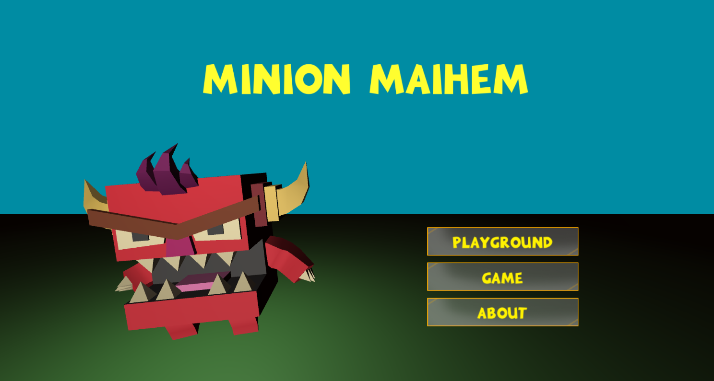
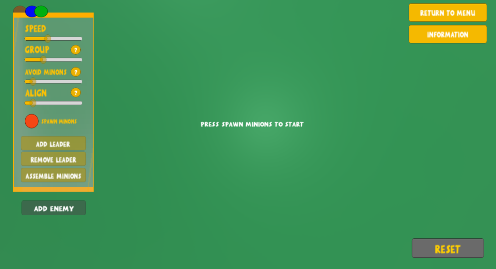
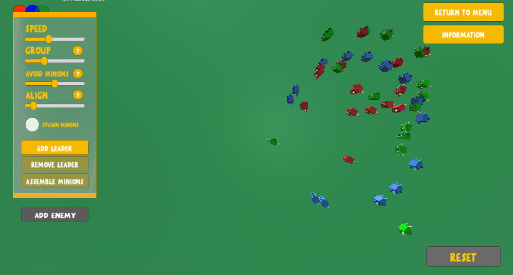
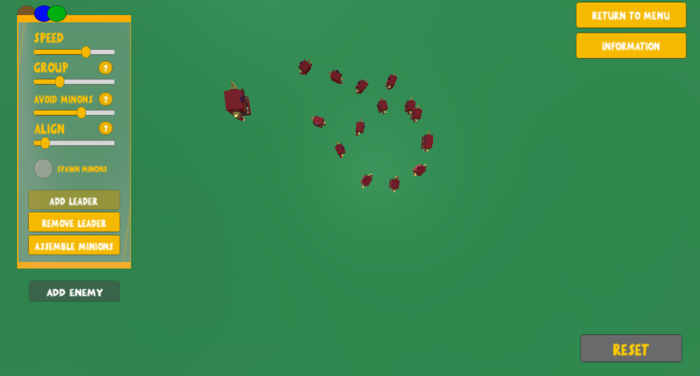
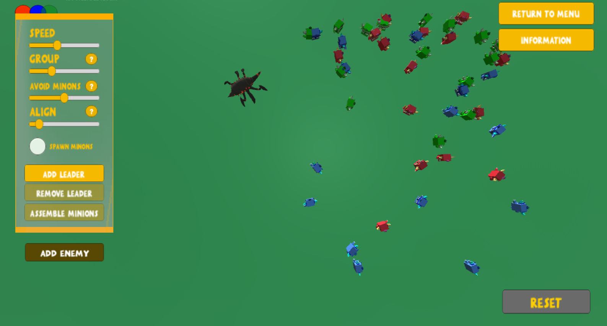
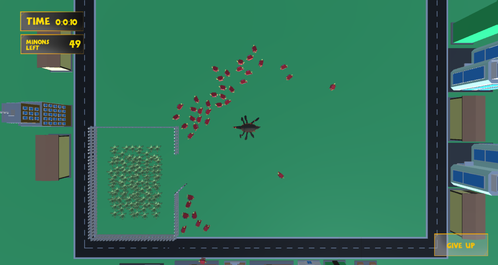
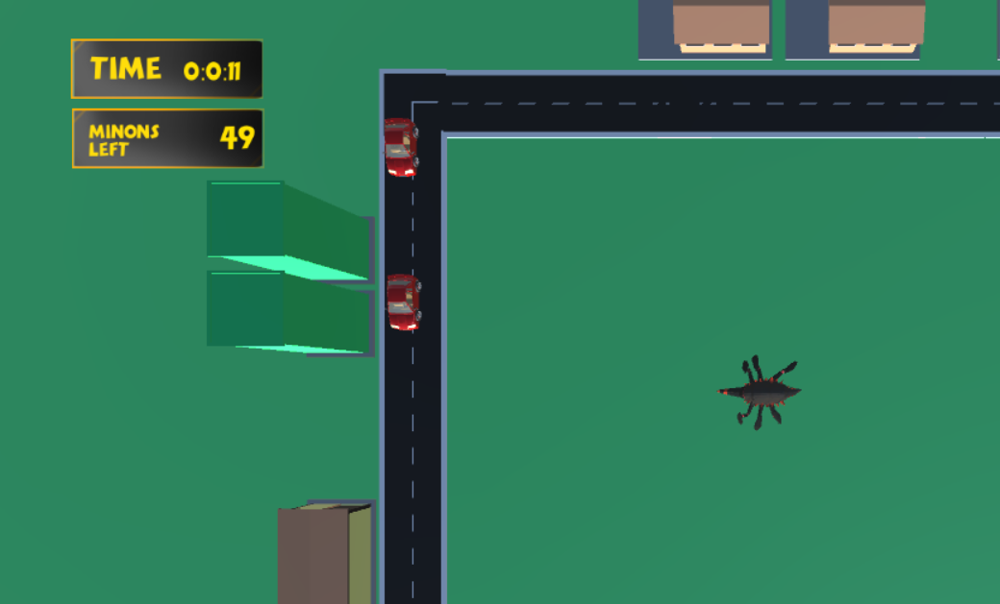

# MinionMAIhem
An interactive simulation of group behaviour and a small game to display how a flocking AI can be used in a game. Part of the course 'AI for interactive media' (TNM095) at Linköping University 2019. 

<h2>Game Engine and Coding</h2>

The project was conducted using the game engine Unity and its 3D environment. By using a game engine it was possible to import graphics in an easy way as well as adding some additional AI using Unity’s integrated AI-agents to further enhance the simulation and game. The possibility to use Unity features as colliders and gameobject tags simplified the handling of obstacle avoidance. Another advantage of using Unity for the implementation was the possibility to implement the orientation of theMinionsusing Quaternions instead of saving and keeping track of the rotation.

<h2>Simulation - the Playground</h2>

The simulation was called playground in the final project and in the playground the user can read about the boids algorithm and have the possibility to spawn Minions of three different flocks, distinguished by their color. The user can then adjust the weights for the basic steering rules, change the speed and add a leader to each group. When all three groups have spawned, the user can add an enemy to the scene that chases the Minions.

The leader itself is an AI-agent using the built-in functionality in Unity and it patrols between a number of points on the screen. The leader also has the option to assemble all the Minions of the same color, when the user press the assemble button all Minions sets its goal position to be the position of the leader until they are within a small distance from the leader.

When adding an enemy to the scene, the Minions will try to escape the enemy if it is within a specified distance from it. Then the Minion will update its goal position according with a repulsice force and thereby turn it away from the enemy. A fear factor that is multiplied with the repulsive force makes Minion sprint while fleeing from the enemy. While fleeing, the Minion stops taking into consideration the other Minion in its group, it just flees until it is within a safe distance from the enemy.

The graphical user interface of the application was constructed with focus on fulfilling the project goal of creating a good learning opportunity for the users. Every slider has a button with a question mark and when hovering, the user gets an explanation of which flocking rule the corresponding slider affects. When hovering over other buttons, the user also gets knowledge in how to use the simulation.

<h2>The Game</h2>

When the implementation of the simulation area was completed, the next step consisted of considering how this flocking algorithm could be used in a game. Multiple approaches was possible but the ending decision was to let the player be the enemy with the goal of chasing the Minions into a closed area and use the enemy avoidance as core mechanics in the game.

When starting the game, the player has the possibility to choose the number of Minions being spawned and should then chase them as fast as possible inside the fences. The player will get more points for each Minion but will also get higher points for quicker times so the player needs to adjust the number to maximize their score.

In order to further emphasize how the use of AI can enhance the experience of a game, some more AI features were added. Multiple cars are driving around the edge of the game area and they are implemented using AI-agents and much like the leaders, they patrol a number of points. In this case, the corners of the streets.

